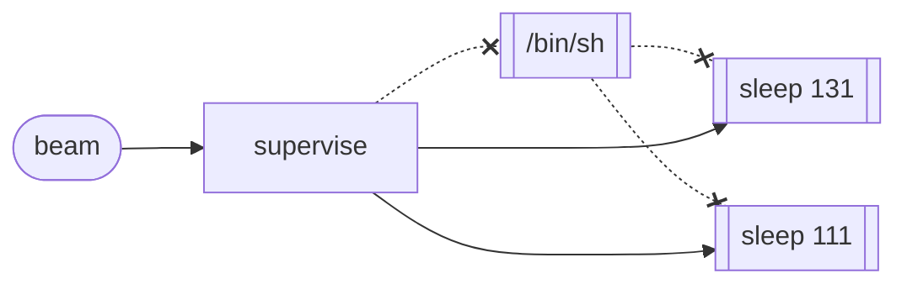
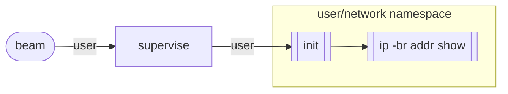
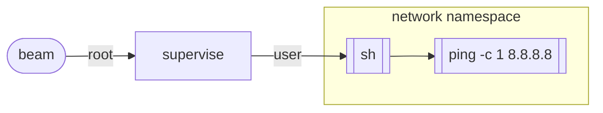
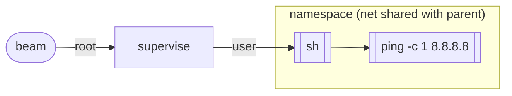
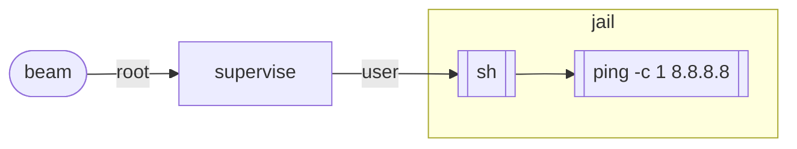

# Stdio

Stream standard I/O from system processes.

Reliably reap, restrict and isolate system tasks:
[Stdio](https://hexdocs.pm/stdio/) is a control plane for processes.


## Installation

`Stdio` is an Elixir library. The package can be installed by adding
`stdio` to your list of dependencies in `mix.exs`:

```elixir
def deps do
  [
    {:stdio, "~> 0.1.0"}
  ]
end
```

## Usage

```elixir
iex> Stdio.stream!("echo test") |> Enum.to_list()
[stdout: "test\n", exit_status: 0]
```

Commands use `/bin/sh -c`:

```elixir
iex> Stdio.stream!("pstree $$") |> Enum.to_list()
[stdout: "sh---pstree\n", exit_status: 0]
```


### Pipes

Streams can be piped into processes:

```elixir
iex> ["let", "it", "crash"] |> Stdio.pipe!("tr '[a-z]' '[A-Z]'") |> Enum.to_list()
[stdout: "LETITCRASH", exit_status: 0]
```


### Argument List

Commands can executed without an intermediary shell process by using
an argv. Since `$PATH` is not consulted, the path to the executable
is required:

```elixir
iex> Stdio.stream!(["/bin/echo", "test"]) |> Enum.to_list()
[stdout: "test\n", exit_status: 0]
```


### Background Processes

Background and daemonized processes are reaped when the foreground
process exits:

```elixir
iex> Stdio.stream!("sleep 131 & sleep 111 & echo $$") |> Enum.to_list()
[stdout: "25723\n", exit_status: 0]
iex> Stdio.Procfs.children(25723)
[]
```



### Setuid Binaries

Setuid processes are disabled by default to prevent unkillable processes.

```elixir
iex> Stdio.stream!("ping -c 1 8.8.8.8") |> Enum.to_list()
[stderr: "ping: ssend socket: Operation not permitted\n", exit_status: 71]
```

The process can escalate privileges by using the `setuid` option:

```elixir
iex> Stdio.stream!("ping -c 1 8.8.8.8", Stdio.Process, setuid: true) |> Enum.to_list()
[
  stdout: "PING 8.8.8.8 (8.8.8.8): 56 data bytes\n64 bytes from 8.8.8.8: icmp_seq=0 ttl=116 time=1.726 ms\n",
  stdout: "\n--- 8.8.8.8 ping statistics ---\n1 packets transmitted, 1 packets received, 0.0% packet loss\nround-trip min/avg/max/stddev = 1.726/1.726/1.726/0.000 ms\n",
  exit_status: 0
]
```

### Privileges

> #### Warning
> Some behaviours may require running system processes as the root user.
> 
> For setup, see
> [Stdio.setuid/0](https://hexdocs.pm/stdio/Stdio.html#setuid/0).

### Process Isolation

Behaviours can implement process restrictions or process isolation. For
example, by default the `Stdio.Rootless` behaviour does not have network
access:

```elixir
iex> Stdio.stream!("ip -br addr show", Stdio.Rootless) |> Enum.to_list()
[stdout: "lo               DOWN           \n", exit_status: 0]
```



### Linux Container

The `Stdio.Container` behaviour also disables network access:

```elixir
iex> Stdio.stream!("ping -c 1 8.8.8.8", Stdio.Container, setuid: true) |> Enum.to_list()
[stderr: "ping: connect: Network is unreachable\n", exit_status: 2]
```



If `setuid` is allowed and the `host` network is shared, `ping` works
as expected:

```elixir
iex> Stdio.stream!("ping -c 1 8.8.8.8", Stdio.Container, setuid: true, net: :host) |> Enum.to_list()
[
  stdout: "PING 8.8.8.8 (8.8.8.8) 56(84) bytes of data.\n64 bytes from 8.8.8.8: icmp_seq=1 ttl=115 time=32.4 ms\n\n--- 8.8.8.8 ping statistics ---\n1 packets transmitted, 1 received, 0% packet loss, time 0ms\nrtt min/avg/max/mdev = 32.390/32.390/32.390/0.000 ms\n",
  exit_status: 0
]
```



### FreeBSD Jails

FreeBSD Jails work in a similar way. An argv is used because the process
is `chroot(2)`'ed in `/rescue`, a directory containing statically linked
binaries. By default `setuid` and `net` are disabled:

```elixir
iex> Stdio.stream!(["./ping", "-c", "1", "8.8.8.8"], Stdio.Jail, path: "/rescue") |> Enum.to_list()
[stderr: "ping: ssend socket: Protocol not supported\n", exit_status: 71]
```



## Documentation

Documentation is available on [hexdocs](https://hexdocs.pm/stdio/).
