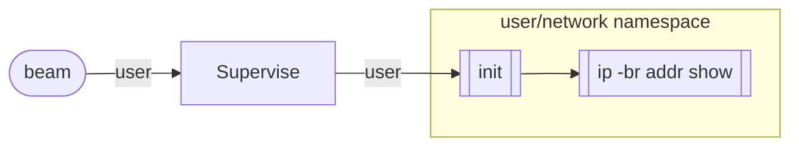

# Stdio

[](https://hex.pm/packages/stdio)
[](https://hexdocs.pm/stdio/)

Stream standard I/O from system processes.

Reliably reap, restrict and isolate system tasks:
[Stdio](https://github.com/msantos/stdio) is a control plane for processes.


## Installation

`Stdio` is an Elixir library. The package can be installed by adding
`stdio` to your list of dependencies in `mix.exs`:

```elixir
def deps do
  [
    {:stdio, "~> 0.4.3"}
  ]
end
```

## Usage

```elixir
iex> Stdio.stream!("echo test") |> Enum.to_list()
[stdout: "test\n", exit_status: 0]
```

Commands use `/bin/sh -c`:

```elixir
iex> Stdio.stream!("pstree $$") |> Enum.to_list()
[stdout: "sh---pstree\n", exit_status: 0]
```


### Pipes

Streams can be piped into processes:

```elixir
iex> ["let", "it", "crash"] |> Stdio.pipe!("tr '[a-z]' '[A-Z]'") |> Enum.to_list()
[stdout: "LETITCRASH", exit_status: 0]
```


### Argument List

Use an argv to execute a command without an intermediary shell
process. `$PATH` is not consulted: the path to the executable is required.

```elixir
iex> Stdio.stream!(["/bin/echo", "test"]) |> Enum.to_list()
[stdout: "test\n", exit_status: 0]
```


### Background Processes

Background and daemonized processes are reaped when the foreground
process exits:

```elixir
iex> Stdio.stream!("sleep 131 & sleep 111 & echo $$") |> Enum.to_list()
[stdout: "25723\n", exit_status: 0]
iex> Stdio.Procfs.children(25723)
[]
```


### Setuid Binaries

Setuid processes are disabled by default to prevent unkillable processes.

```elixir
iex> Stdio.stream!("ping -c 1 8.8.8.8") |> Enum.to_list()
[stderr: "ping: ssend socket: Operation not permitted\n", exit_status: 71]
```

The process can escalate privileges by using the `setuid` option:

```elixir
iex> Stdio.stream!("ping -c 1 8.8.8.8", Stdio.Process, setuid: true) |> Enum.to_list()
[
  stdout: "PING 8.8.8.8 (8.8.8.8): 56 data bytes\n64 bytes from 8.8.8.8: icmp_seq=0 ttl=116 time=1.726 ms\n",
  stdout: "\n--- 8.8.8.8 ping statistics ---\n1 packets transmitted, 1 packets received, 0.0% packet loss\nround-trip min/avg/max/stddev = 1.726/1.726/1.726/0.000 ms\n",
  exit_status: 0
]
```

### Privileges

> #### Warning
>
> Some behaviours may require running system processes as the root user.
>
> For setup, see
> [Stdio.setuid/0](https://hexdocs.pm/stdio/Stdio.html#setuid/0).

Behaviours may change the root filesystem for the process. The default
`chroot(2)` directory hierarchy can be created by running:

```elixir
iex> Stdio.Container.make_chroot_tree!()
```

### Process Isolation

Behaviours can implement process restrictions or process isolation. For
example, by default the `Stdio.Rootless` behaviour does not have network
access:

```elixir
iex> Stdio.stream!("ip -br addr show", Stdio.Rootless) |> Enum.to_list()
[stdout: "lo               DOWN           \n", exit_status: 0]
```



### Linux Container

The `Stdio.Container` behaviour also disables network access:

```elixir
iex> Stdio.stream!("ping -c 1 8.8.8.8", Stdio.Container, setuid: true) |> Enum.to_list()
[stderr: "ping: connect: Network is unreachable\n", exit_status: 2]
```


If `setuid` is allowed and the `host` network is shared, `ping` works
as expected:

```elixir
iex> Stdio.stream!("ping -c 1 8.8.8.8", Stdio.Container, setuid: true, net: :host) |> Enum.to_list()
[
  stdout: "PING 8.8.8.8 (8.8.8.8) 56(84) bytes of data.\n64 bytes from 8.8.8.8: icmp_seq=1 ttl=115 time=32.4 ms\n\n--- 8.8.8.8 ping statistics ---\n1 packets transmitted, 1 received, 0% packet loss, time 0ms\nrtt min/avg/max/mdev = 32.390/32.390/32.390/0.000 ms\n",
  exit_status: 0
]
```


### FreeBSD Jails

FreeBSD Jails work in a similar way. An argv is used because the process
root directory has been changed to `/rescue`, a directory containing
statically linked binaries. By default `setuid` and `net` are disabled:

```elixir
iex> Stdio.stream!(["./ping", "-c", "1", "8.8.8.8"], Stdio.Jail, path: "/rescue") |> Enum.to_list()
[stderr: "ping: ssend socket: Protocol not supported\n", exit_status: 71]
```


## Examples

### inetd

The following code is an example of an `inetd(8)` service using forked system
processes to handle client requests. It is adapted from the [Task and
gen_tcp](https://elixir-lang.org/getting-started/mix-otp/task-and-gen-tcp.html)
echo server in the Elixir documentation.

To run from iex:

```elixir
iex> Inetd.Server.start([
...> %{port: 7070, command: "cat -n"},
...> %{ip: "127.0.0.1", port: 7071, command: "stdbuf -o0 tr [A-Z] [a-z]"}
...> ])
```

```elixir
defmodule Inetd.Server do
  require Logger

  def start(spec) do
    children =
      spec
      |> Enum.map(fn %{port: port, command: command} = m ->
        {:ok, ip} = :inet_parse.address(String.to_charlist(Map.get(m, :ip, "::")))
        behaviour = Map.get(m, :behaviour, Stdio.Rootless)

        Supervisor.child_spec(
          {Task, fn -> Inetd.Server.accept(ip, port, command, behaviour) end},
          id: {ip, port},
          restart: :permanent
        )
      end)

    children = [{Task.Supervisor, name: Inetd.TaskSupervisor}] ++ children

    opts = [strategy: :one_for_one, name: Inetd.Supervisor]
    Supervisor.start_link(children, opts)
  end

  @doc """
  Starts accepting connections on the given `port`.
  """
  def accept(ip, port, command, behaviour) do
    {:ok, socket} =
      :gen_tcp.listen(
        port,
        [:binary, packet: :line, active: false, reuseaddr: true, ip: ip]
      )

    Logger.info("Accepting connections on port #{port}")
    loop_acceptor(socket, command, behaviour)
  end

  defp loop_acceptor(socket, command, behaviour) do
    {:ok, client} = :gen_tcp.accept(socket)

    {:ok, pid} =
      Task.Supervisor.start_child(Inetd.TaskSupervisor, fn ->
        serve(client, command, behaviour)
      end)

    :ok = :gen_tcp.controlling_process(client, pid)
    loop_acceptor(socket, command, behaviour)
  end

  defp serve(socket, command, behaviour) do
    Stream.resource(
      fn -> socket end,
      fn socket -> read_line(socket) end,
      fn socket -> :gen_tcp.close(socket) end
    )
    |> Stdio.pipe!(command, behaviour)
    |> Stream.transform(socket, fn data, socket ->
      write_line(data, socket)
    end)
    |> Stream.run()
  end

  defp read_line(socket) do
    case :gen_tcp.recv(socket, 0) do
      {:ok, data} ->
        {[data], socket}

      {:error, _} ->
        {:halt, socket}
    end
  end

  defp write_line({:stdout, line}, socket) do
    case :gen_tcp.send(socket, line) do
      :ok ->
        {[], socket}

      {:error, _} ->
        {:halt, socket}
    end
  end

  defp write_line({:stderr, line}, socket) do
    case :gen_tcp.send(socket, line) do
      :ok ->
        {[], socket}

      {:error, _} ->
        {:halt, socket}
    end
  end

  defp write_line({msg, _} = data, socket) when msg in [:exit_status, :termsig] do
    Logger.info("#{inspect(data)}")
    {:halt, socket}
  end
end
```

## Documentation

Documentation is available on [hexdocs](https://hexdocs.pm/stdio/).
